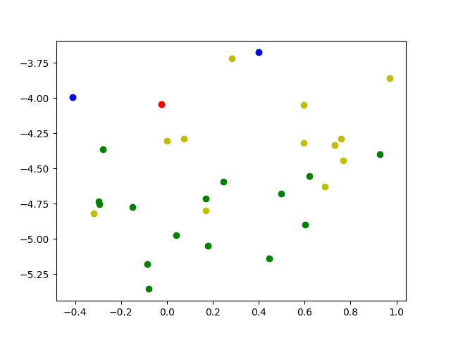

## Simple vector database query example
Find the closest similar vectors. Note that we are using `TSNE` and a vector with 100 features so there is a small 

See [VectorStream.py](./test_query.py) for the code.

